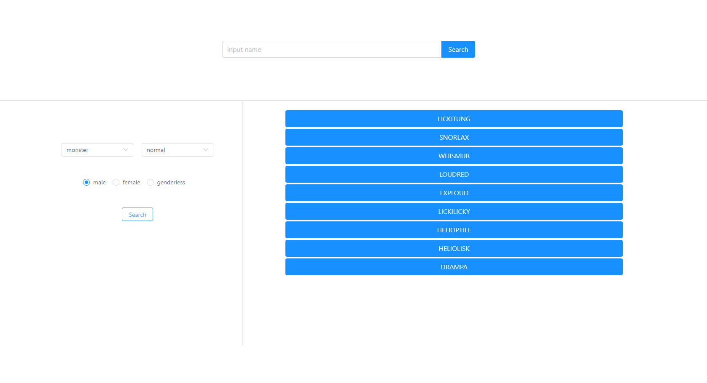

# pokemonGuide-react  

You can find any Pokemon and see its abilities :fish_cake:

### [Demo on Heroku](https://timer-stopwatch-weather-react.herokuapp.com/) :point_left:

- React
- Ant Design
- JSX
- HTML
- CSS
- REST API
- Adaptive Web Design



### Getting Started
Run the app:
```
> npm install
> npm start
```
